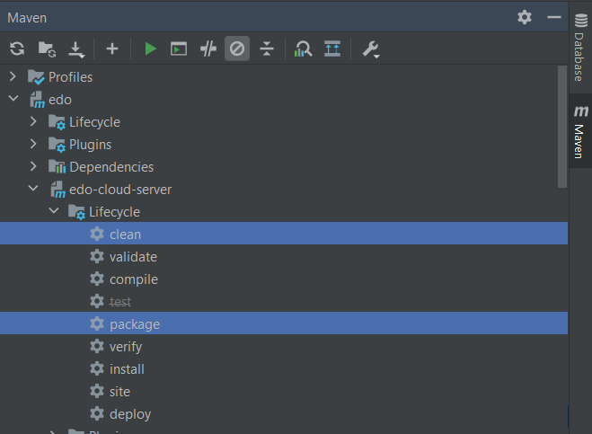
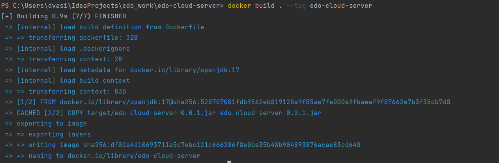

<h2>Описание проекта "EDO"</h2>

- [Summary](#summary)
- [Stack](#stack)
- [MVP](#mvp)
- [Backlog](#backlog)
- [Структура проекта](#структура-проекта)
    - [Бэкенд](#бэкенд)
    - [Фронтенд](#фронтенд)
- [Работа на проекте](#работа-на-проекте)
    - [С чего начинать](#с-чего-начинать)
    - [О таскборде](#о-таскборде)
    - [Как выполнять задачи](#как-выполнять-задачи)
    - [Проверка задач](#проверка-задач)
    - [Требования к коду](#требования-к-коду)
    - [Созвоны по проекту](#созвоны-по-проекту)
- [Дополнительные материалы](#дополнительные-материалы)
    - [Spring Boot Dev Tools](#Spring-Boot-Dev-Tools)
    - [Настройка файлового хранилища](#настройка-файлового-хранилища)
    - [Flyway](#flyway)
    - [RabbitMQ](#rabbitmq)
    - [Запуск модуля с помощью Dockerfile](#запуск-модуля-с-помощью-dockerfile)

[//]: # (    - [Аутентификация]&#40;#аутентификация&#41;)

### Summary

Реализуем функционал обработки обращений граждан и обменом электронными документами между ведомствами.

Проект рассчитан на студентов, успешно завершивших этап Pre-Project в Kata Academy.

### Stack

Проект пишется на базе `Java 17`, `Spring Boot 3`, `Maven` и архитектуре REST.
Работаем с базой данных `PostgreSQL 12` через `Spring Data` и `Hibernate`.

Чтобы не писать boilerplate-код, используем на проекте [Lombok](https://projectlombok.org/features/all).

Все контроллеры и их методы нужно сразу описывать
аннотациями [Swagger](https://docs.swagger.io/swagger-core/v1.5.0/apidocs/allclasses-noframe.html).
Swagger UI при запущенном приложении крутится [здесь](http://localhost:8888/swagger-ui.html).

Таск-борд находится прямо на [Gitlab]&#40;https://gitlab.com/__-__/edo/-/boards.

Dev-stand отсутствует, будем поднимать и разворачивать локально.

### MVP

[MVP](https://ru.wikipedia.org/wiki/%D0%9C%D0%B8%D0%BD%D0%B8%D0%BC%D0%B0%D0%BB%D1%8C%D0%BD%D0%BE_%D0%B6%D0%B8%D0%B7%D0%BD%D0%B5%D1%81%D0%BF%D0%BE%D1%81%D0%BE%D0%B1%D0%BD%D1%8B%D0%B9_%D0%BF%D1%80%D0%BE%D0%B4%D1%83%D0%BA%D1%82) -
API (полностью описанное в Swagger), которое будет уметь создавать обращения вручную, получать по интеграционным каналам
и оповещать пользователей о новых документах.
Работать с таким API можно будет через веб-интерфейс Swagger и Postman.

### Backlog

Фичи:
<ul>
<li>Создание, редактирование, удаление обращений</li>
<li>Создание личного кабинета работника, добавление аутентификации через логин/пароль, Google, социальные сети</li>
<li>Интеграция с Keycloak</li>
<li>реализация функционала обратной связи с гражданами через e-mail и Telegram</li>
<li>создание ролевой модели для взаимодействия с API</li>
<li>внедрение взаимодействия с яндекс.картами для парсинга адресов</li>
<li>внедрение интеграции с внешними источниками данных для синхронизации данных пользователей</li>
</ul>

Импрувменты:

<ul>
<li>логирование через Slf4j + log4j2</li>
<li>юнит-тесты и интеграционные тесты</li>
<li>анализ качества кода через SonarQube</li>
</ul>

## Структура проекта

### Бэкенд

Проект основан на архетипе webapp.
Слои:
<ul>
<li><code>config</code> конфигурационные классы, в т.ч. Spring Security, инструменты аутентификации</li>
<li><code>entity</code> сущности базы данных</li>
<li><code>dto</code> специальные сущности для передачи/получения данных в/с апи</li>
<li><code>repository</code> dao-слой приложения, реализуем в виде интерфейсов Spring Data, имплементирующих JpaRepository</li>
<li><code>service</code> бизнес-логика приложения, реализуем в виде интерфейсов и имплементирующих их классов</li>
<li><code>controller</code> обычные и rest-контроллеры приложения</li>
<li><code>util</code> пакет для утилитных классов: валидаторов, шаблонов, хэндлеров, эксепшнов</li>
<li><code>feign</code> Feign клиенты для взаимодействия между микросервисами</li>
<li><code>listener</code> слушатели очередей для выборки данных</li>
<li><code>publisher</code> отправители в очереди</li>
</ul>

### Фронтенд

Фронтенд пишет команда фронтенда. Мы команда бэкенда.

## Работа на проекте

### С чего начинать

Доступы. Если ты читаешь это, значит доступ к проекту у тебя уже есть )
<ol>
<li>загрузи проект себе в среду разработки.</li>
<li>изучи весь проект - начни с pom, properties файлов и конфигурационных классов.</li>
<li>создай локальную базу данных PostgeSQL с названием <code>edo_db</code>. Можешь изменить параметры доступа (логин, пароль) в конфиге проекта под свои нужды, 
но не отправляй эти данные в Git.</li>
<li>добейся успешного запуска проекта. Первым запускается модуль edo-cloud-server. <a href="http://localhost:8761/"> Проверить</a>.</li>
<li>изучи <a href="https://gitlab.com/__-__/edo/-/boards">таск-борд.</a>
</ol>

[//]: # (Для отправки почты используется Google аккаунт.<br/>)

[//]: # (Вход в него с именем "uxair1.kata" и паролем "Mail4@Uxair1" &#40;без кавыек&#41;.<br/>)

[//]: # (Важно учитывать, что для отправки почты использзуется отдельный пароль &#40;т.н пароль приложения&#41;,)

[//]: # (так как в случае наличи двухфакторной аутентификации использование пароля от эккаунта не позволит отправить почту.<br/>)

[//]: # (Именно данный пароль и указан в найстройке в .yml файле.)

[//]: # (При отправке почты всегда можно зайти в эккаунт через браузер и проверить, что она в папке Отправленные.)

### О таскборде

Таск-борд строится по принципу Kanban - он разделён на столбцы, каждый из которых соответствует определённому этапу
работы с задачей:
<ul>
<li><code>Backlog</code> задачи на <b>новый функционал</b>, корзина функционала приложения. Здесь можете создавать карточки на таски, которые считаете необходимыми</li>
<li><code>TODO</code> задачи, требующие выполнения</li>
<li><code>In Progress</code> выполняемые в данный момент задачи, обязательно должны иметь исполнителя</li>
<li><code>Cross-review </code> задачи на этапе перекрёстной проверки студентами</li>
<li><code>Final Review</code> задачи на проверке у техлида</li>
<li><code>Closed</code> выполненные задачи</li>
</ul>

У каждой задачи есть теги:
<ul>
<li><code>Feature/Refactor</code> - новый функционал или переработка существующего</li>
<li><code>Bug</code> - таска на исправление бага до или после тестирования</li>
<li><code>Reworking</code> - таска на исправлении замечаний после кросс или файнал ревью</li>

[//]: # (<li><code>InQA</code> - задача с такой меткой находится у тестировщика в работе </li>)
<li><code>Backlog, ToDo, InProgress, CrossReview, FinalReview</code> - этапы прохождения задачи по борде</li>
</ul>

### Как выполнять задачи

<ul>
<li>в графе <code>TODO</code> на таск-борде выбери карточку с задачей и назначь её себе для исполнения</li>
<li>загрузи себе последнюю версию ветки <code>develop</code></li>
<li>создай от <code>develop</code> свою собственную ветку для выполнения взятой задачи. Свою ветку назови так, чтобы было понятно, чему посвящена задача. В начале имени ветки проставь номер задачи с Gitlab. Например, <code>313_adding_new_html_pages</code></li>
<li>выполни задачу, обязательно сделай юнит-тесты на методы и, если всё ок, залей её в репозиторий проекта</li>
<li>создай на своей ветке merge request, в теле реквеста укажи <code><i>Closes #здесь-номер-таски"</i></code>. Например, <code>Closes #313</code></li>
<li>перенеси задачу в столбец <code>Cross-review</code></li>
</ul>

### Проверка задач

На этапе кросс-ревью студенты проверяют задачи, выполненные друг другом.
В случае, если к коду есть замечания, проверяющий пишет замечания в мердж реквесте и оставляет комментарий в карточке.
Если к коду претензий нет, проверяющий студент ставит к карточке лайк.

**Каждая карточка (студенческая задача) должна быть проверена как минимум 2 другими студентами и одобрена ими (т.е.
собрать не менее 2 лайков). Если студенты не посмотрели задачу за 3 дня, то задача отправляется в Final Review**

Только после этого карточку можно переносить в столбец `Final Review`.

Затем код проверяет техлид (ментор) и в случае обнаружения ошибок ставит тег `Reworking` и переносит её в
столбец `InProgress`.
Если всё ок - merge request принимается, ветка студента сливается с основной веткой проекта, а карточка переносится в
столбец `Closed`.

### Требования к коду

- сделайте себе понятные никнеймы (имя + фамилия) в Git. Не хочу гадать, кто, где и что писал.

#### Команды для гита (выполнять по очереди): <code>git config --global user.name "Фамилия Имя"<br> git config --global user.email "Email"</code>

- при использовании Stream, Optional, Builder необходимо писать каждый метод с новой строки.

#### Пример:

````java
Stream.of("a","b","c")
        .filter(string->string.equals("a"))
        .sorted()
        .collect(toSet());
````

- для каждого класса и (желательно) методов пишите комментарии в формате <b>Javadoc</b>:
    - над классом: что это за класс, зачем нужен. Описывайте поля.
    - над методом: что делает, какие параметры принимает (и что это такое), что возвращает.
- свободно создавайте собственные вспомогательные классы в пакете Util - типа утилиток для страховки от null и типа
  того. Модуль edo-common.
- в REST-контроллерах и DTO пользоваться аннотациями Swagger - причём как сами контроллеры в целом, так и их отдельные методы.
  Посмотрите пример в проекте.
- на полях сущностей можно и нужно расставлять констрейнты для проверки формата, длины введённых значений, проверки
  чисел на положительность и т.д.
- пишите Commit message как можно более подробно! На английском языке - пользуйтесь переводчиком при необходимости. Также указывайте номер задачи.
- при объявлении переменной используйте ключевое слово <code>var</code>.
- используйте STATIC импорт для статических методов и переменных(Alt+Enter в помощь).
- всегда пользуйтесь Ctrl+Alt+L.

### Требования к логированию работы контроллеров:

1. В каждый метод необходимо добавить логирование с описанием произведенной операции на уровне info.

2. Если объект не найден, вывести сообщение уровня warning ("not found" или "does not exist") с описанием произведенной
   операции.

### Созвоны по проекту

Созвоны проходят по понедельникам, средам в оговорённое время.
Регламент:

- длительность до 15 минут
- формат: доклады по 3 пунктам:
    - что сделано с прошлого созвона
    - какие были/есть трудности
    - что будешь делать до следующего созвона
- техлид (ментор) на созвонах код не ревьюит

Любые другие рабочие созвоны команда проводит без ограничений, т.е. в любое время без участия техлида.
Договаривайтесь сами :)

## Дополнительные материалы

### Spring Boot Dev Tools

Благодаря данной зависимости, разработчик получает возможность ускорить разработку проекта на Spring Boot в IDEA IDE и
сделать этот процесс более приятным и продуктивным. А не вручную перегружать сборку каждый раз, когда надо проверить
код. IDEA будет делать это за него.

####Как подключить

+ [mkyong.com](https://mkyong.com/spring-boot/intellij-idea-spring-boot-template-reload-is-not-working/)
+ [metakoder.com](https://www.metakoder.com/blog/spring-boot-devtools-on-intellij/)
+ [YouTube Video](https://youtu.be/XYTET4vSn6k)

####Полезные ссылки:

+ [baeldung.com](https://www.baeldung.com/spring-boot-devtools)
+ [habr.com](https://habr.com/ru/post/479382/)

[//]: # (### Аутентификация)

[//]: # ()

[//]: # (В проект подключена аутентификация с помощью keycloak, который поднимается в docker запускам файла)

[//]: # (keycloak-docker-compose.yml, в котором совместно с keycloak также поднимается база данных, и настраиваются пользователи.)

[//]: # (Для доступа к keycloak используется пользоватье с логином keycloak-admin и паролем admin.)

[//]: # (Так же создаётся реалм airline-realm, который используется для авторизации в приложении.)

[//]: # (Тестовые пользователи в нём admin и user с паролями admin и user соответственна, у админа назначена роль admin, у)

[//]: # (user - passenger.)

[//]: # ()

[//]: # (В контроллер AuthenticateController в метод authenticate передаётся DTO с именем и паролем в случае успешной)

[//]: # (аутентификации он возвращает токен который потом используется в запросах для)

[//]: # (доступа к эндпоинтам котрноллеров. Для того чтобы организавать аторизованный доступ к эндпоинтам контроллеров достаточно)

[//]: # (пометить метод контроллера аннотацией **_@PreAuthorize&#40;&#41;_** и в скобках указать роль например _**hasRole&#40;'admin'&#41;**_)

[//]: # (В keycloak настроены роли supeAdmin, admin, manager, passenger.)

[//]: # ()

[//]: # (#### Пример метода:)

[//]: # (````java)

[//]: # ( @GetMapping&#40;"/admin"&#41;)

[//]: # ( @PreAuthorize&#40;"hasRole&#40;'admin'&#41;"&#41;)

[//]: # ( public String getAdminInfo&#40;&#41; {)

[//]: # (   return "admin info";)

[//]: # ( } )

[//]: # (````)

### Настройка файлового хранилища

**edo-file-storage**

Для работы с edo-file-storage нам понадобятся такие программы как: 
1.	Postman (для удобства отправки запросов)
2.	MinIO (для запуска хранилища файлов. Рекомендуется использовать докер, т.к. он упрощает запуск сервера (не нужно будет постоянно вводить команды в консоль для запуска сервера)
Инструкция по установки minIO без докера: 
[YouTube](https://www.youtube.com/watch?v=1mcdnGZpXUI&list=LL&index=3&t=725s)
3.	Docker (для удобства запуска MinIO) 

Если скачиваете докер, то скачивание minIO необязателен, т.к. он автоматически скачает его и подключит Инструкция по установки minIO в докере тут:
https://hub.docker.com/r/minio/minio. 

Для запуска сервера и установки логина и пароля используйте следующую команду в консоли: 

<code>docker run -p 9000:9000 -d -p 9001:9001 -e "MINIO_ROOT_USER=admin" -e "MINIO_ROOT_PASSWORD=password" quay.io/minio/minio server /data --console-address ":9001"</code>

Для успешной работы приложения необходимо установить следующие логин и пароль для MinIO:
  
- username: **admin**
  
- password: **password**

Для перехода в хранилище иcпользуйте ссылку http://127.0.0.1:9001.
Создайте там корзину с названием **«my-bucketname»**.

Для проверки работоспособности сервиса необходимо сначала запустить MinIO, после чего запустить следующие сервисы: 

- ServerApplication **(всегда запускается первым)**

- EdoFileStorageApplication

После запуска сервисов, смотрим номер порта tomcat в EdoFileStorageApplication, переходим в Postman и проверяем методы:
1)	**checkConnection**

Выбираем метод **GET** и указываем следующую ссылку: 

>http://localhost:../api/file-storage/checkConnection

После чего нажимаем send для отправки запроса, в ответе должны получить код статуса 200, Connection checked
2)	**uploadFileToMinIO**

Выбираем метод **POST** и указываем следующую ссылку: 

>http://localhost:../api/file-storage/upload

После чего переходим во вкладку body и указываем следующие параметры:

- KEY: **file**

- VALUE: **(файл, который мы хотим загрузить в форматах doc, docx, png, jpeg, pdf)**

- KEY: **key**

- VALUE: **(ключ в формате UUID)**

После чего нажимаем send для отправки запроса, в ответе должны получить код статуса 200.

3)	**downloadFile**

Выбираем метод **GET** и указываем следующую ссылку:

>http://localhost:../api/file-storage/download/(название файла в формате UUID)

После чего нажимаем send для отправки запроса, в ответе должны получить код статуса 200 и сам файл.

Для проверки форматов **doc** и **docx** необходимо выполнить запрос через браузер в следующем виде:

>http://localhost:../api/file-storage/download/(название файла в формате UUID)?type=doc

>http://localhost:../api/file-storage/download/(название файла в формате UUID)?type=docx

4)	**delete**

Выбираем метод **DELETE** и указываем следующую ссылку: 

>http://localhost:.../api/file-storage/delete/(название файла в формате UUID)

После чего нажимаем send для отправки запроса, в ответе должны получить код статуса 200, File is deleted

### edo-rest

Для работы с **edo-rest** нам понадобятся такие программы как:
1. **Postman** (для удобства отправки запросов).
2. **MinIO** (для запуска хранилища файлов. Рекомендуется использовать докер, т.к. он упрощает запуск сервера (не нужно будет постоянно вводить команды в консоль для запуска сервера)
      Инструкция по установки minIO без Docker:
      [YouTube](https://www.youtube.com/watch?v=1mcdnGZpXUI&list=LL&index=3&t=725s).
3. **Docker** (для удобства запуска MinIO и PostgreSQL).
4. **PostgreSQL** (Можно использовать докер, т.к. он упрощает запуск БД. Запуск PostgreSQL в Docker: https://habr.com/ru/post/578744/).

Если скачиваете Docker, то скачивание MinIO и postgres необязателен, т.к. он автоматически скачает его и подключит Инструкция по установки minIO в докере тут:
https://hub.docker.com/r/minio/minio.

Для запуска сервера MinIO и установки логина и пароля используйте следующую команду в консоли:

<code>docker run -p 9000:9000 -d -p 9001:9001 -e "MINIO_ROOT_USER=login" -e "MINIO_ROOT_PASSWORD=password" quay.io/minio/minio server /data --console-address ":9001"</code>

Для успешной работы приложения необходимо установить следующие логин и пароль для MinIO:

- username: **admin**

- password: **password**

Для перехода в хранилище иcпользуйте ссылку http://127.0.0.1:9001.
Создайте там корзину с названием **«my-bucketname»**.

Для запуска бд postgres и установки логина и пароля используйте следующую команду в консоли:

<code>docker run --name habr-pg-12.14 -p 5432:5432 -e POSTGRES_USER=postgres -e POSTGRES_PASSWORD=oog -e POSTGRES_DB=edo_db -d postgres:12.14</code>

Для успешной работы приложения необходимо установить следующие логин и пароль в postgres:

- POSTGRES_USER: **postgres**

- POSTGRES_PASSWORD: **oog**

Для проверки работоспособности сервиса необходимо сначала запустить MinIO и PostgreSQL после чего запустить следующие сервисы:

- ServerApplication (всегда запускается первым)
- EdoServiceApplication
- EdoFileStorageApplication (запускать перед edo-rest)
- EdoRestApplication
- EdoRepositoryApplication
- EdoWebsocketApplication
- EdoIntegrationApplication

После запуска сервисов переходим в Postman и проверяем методы:

1)	**uploadOneFile** (загрузка файла в minIO)

Выбираем метод **POST** и указываем следующую ссылку:

>http://localhost:8080/api/rest/minio/upload

После чего переходим во вкладку body и указываем следующие параметры:
- KEY: **file**
- VALUE: **(файл, который мы хотим загрузить)**

После чего нажимаем send для отправки запроса, в ответе должны получить код статуса 200, File uploaded. **(Информация о файле)**.

**Название в формате UUID хранится в корзине minIO**

2)	**downloadOneFile** (скачивание файла с корзины minIO)

Выбираем метод **GET** и указываем следующую ссылку: 

>http://localhost:8080/api/rest/minio/download/ (название файла, как указано в корзине MinIO)


После чего нажимаем send для отправки запроса, в ответе должны получить код статуса 200 и сам файл.

Для проверки форматов, таких как **doc**, **docx** и т.д необходимо выполнить запрос через браузер в следующем виде: 

>http://localhost:8080/api/rest/minio/download/ (название файла в формате UUID)?type=doc

>http://localhost:8080/api/rest/minio/download/ (название файла в формате UUID)?type=docx
3)	**delete** (удаление файла с корзины minIO)

Выбираем метод **DELETE** и указываем следующую ссылку: 

>http://localhost:8080/api/rest/minio/delete/ (**название файла в формате UUID**)

После чего нажимаем send для отправки запроса, в ответе должны получить код статуса 200, File is deleted.


### Flyway

#### Инструкция для разработчика по созданию скриптов миграции

1. все операции с БД происходят в модуле edo-repository:

- сохранение, обновление, удаление происходит при получении данных по очереди или при необходимости через Feign Client.
- Получение данных через Feign клиенты.

2. При необходимости изменить настройки подключения к бд в файле application.yml.
3. В папке resources/db/migration/v.1 создать файл с именем по шаблону
   v_1_год|месяц|число|час|минута|секунда__краткое_описание.sql.
4. Внутри файла написать инструкцию для выполнения.

- Всегда использовать <code>if not exists</code> при создании или обновлении таблицы

5. Если миграция некорректно накатилась, то необходимо руками удалить внесенные изменения и удалить запись в
   таблице <code>flyway_schema_history</code> после чего исправить скрипт

### RabbitMQ

RabbtiMQ - брокер сообщений, позволяющий создать асинхронный обмен сообщениями на основе очередей. Основные понятия:
- Publisher — публикует сообщения в Rabbit;
- Queue (очередь) — контейнер для хранения сообщений;
- Listener — подписывается на очередь и получает от RabbitMQ сообщения;
- Message (сообщение) -  инкапсулирует в себе передаваемые данные (например, JSON) и дополнительные свойства для RabbitMQ.

#### Установка RabbitMQ

Для работы с RabbitMQ он должен быть установлен локально, либо в Docker. Рекомендуется использовать Docker, т.к. установка более простая и быстрая. Для этого в командной строке или терминале IDE достаточно выполнить команду:

`docker run -it --rm --name rabbitmq -p 5672:5672 -p 15672:15672 rabbitmq:3.11-management`

При успешной установке выведется "Server startup complete" и установленные плагины:

>2023-03-14 19:19:58.678534+00:00 [info] <0.730.0> Server startup complete; 4 plugins started.\
>2023-03-14 19:19:58.678534+00:00 [info] <0.730.0>  * rabbitmq_prometheus\
>2023-03-14 19:19:58.678534+00:00 [info] <0.730.0>  * rabbitmq_management\
>2023-03-14 19:19:58.678534+00:00 [info] <0.730.0>  * rabbitmq_web_dispatch\
>2023-03-14 19:19:58.678534+00:00 [info] <0.730.0>  * rabbitmq_management_agent

Management Plugin предоставляет UI в браузере.
Открыть веб-интерфейс можно по ссылке <http://localhost:15672> по умолчанию логин и пароль guest/guest

Официальный гайд по установке: <https://www.rabbitmq.com/download.html>

#### Интеграция RabbitMQ и Spring Boot
1. Убедиться, что имеется зависимость в POM файле
```xml
<dependency>
            <groupId>org.springframework.boot</groupId>
            <artifactId>spring-boot-starter-amqp</artifactId>
</dependency> 
```
2. В классе Constant модуля edo-common создать константу с именем очереди
```java
public static final String REST_TO_SERVICE_APPROVAL_QUEUE = "RestToServiceApprovalQueue";
```
3. Создать в конфигурационном файле бин очереди, используя константу (через статический импорт)
```java
@EnableRabbit
@Configuration
public class RabbitConfig {

    @Value("${spring.rabbitmq.host}")
    private String host;

    @Value("${spring.rabbitmq.port}")
    private Integer port;

    @Bean
    public SimpleRabbitListenerContainerFactory
    rabbitListenerContainerFactory(ConnectionFactory connectionFactory) {
        SimpleRabbitListenerContainerFactory factory = new
                SimpleRabbitListenerContainerFactory();
        factory.setConnectionFactory(connectionFactory);
        factory.setMessageConverter(new Jackson2JsonMessageConverter());
        return factory;
    }

    @Bean
    public ConnectionFactory connectionFactory() {
        return new CachingConnectionFactory(host, port);
    }

    @Bean
    public AmqpAdmin amqpAdmin() {
        return new RabbitAdmin(connectionFactory());
    }

    @Bean
    public RabbitTemplate rabbitTemplate() {
        return new RabbitTemplate(connectionFactory());
    }

    @Bean
    public Queue queue() {
        return new Queue(REST_TO_SERVICE_APPROVAL_QUEUE);
    }
}
```
4. Создать Publisher в пакете publisher (используем также константу с именем очереди)
```java
@Component
@AllArgsConstructor
public class ApprovalPublisher {

    private final RabbitTemplate rabbitTemplate;

    public void produce(ApprovalDto approvalDto) {
       rabbitTemplate.convertAndSend(REST_TO_SERVICE_APPROVAL_QUEUE, approvalDto);
    }
}
```
5. Создать Listener в пакете listener (используем также константу с именем очереди)
```java
@Component
@AllArgsConstructor
public class ApprovalListener {
    
    private final ApprovalService approvalService;

    @RabbitListener(queues = REST_TO_SERVICE_APPROVAL_QUEUE)
    public void receive(ApprovalDto approvalDto) {
        approvalService.save(approvalDto);
    }
}
```

### Запуск модуля с помощью Dockerfile
Для запуска модуля необходим сам Dockerfile и упакованный jar для конкретного модуля.
Например, Dockerfile для edo-cloud-server:

<li>FROM openjdk:17</li>
<li>COPY target/edo-cloud-server-0.0.1.jar edo-cloud-server-0.0.1.jar</li>
<li>ENTRYPOINT ["java","-jar", "edo-cloud-server-0.0.1.jar"]]</li>

Так же необходим сам модуль, упакованный в jar (упаковать можно с помощью maven):

Maven - edo - edo-cloud-server - Lifecycle и выбираем clean, package, скипаем тесты, затем Run Maven Build.



Если package выполнился успешно, то в edo-cloud-server\target будет лежать edo-cloud-server-0.0.1.jar. Переходим к созданию image.

Команда для билда image:

<code>docker build <DOCKERFILE_PATH --tag <IMAGE_NAME></code>

<DOCKERFILE_PATH> - путь к файлу Dockerfile

<IMAGE_NAME> - имя, под которым образ будет создан



Команда для запуска контейнера:

<code>docker run -p 8761:8761 edo-cloud-server</code>


